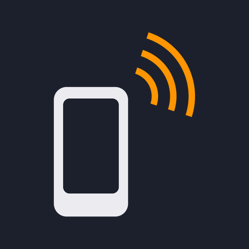
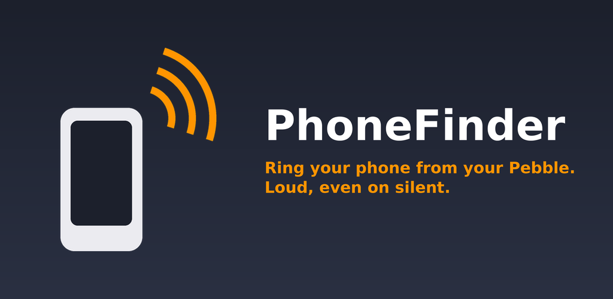
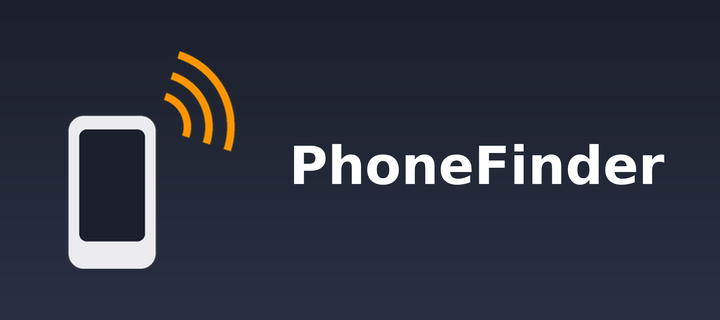

# Store listing assets

Everything here is generated by `tools/generate_assets.py` from a single
motif, so the two store listings and both apps stay visually consistent.
Regenerate with:

```
pip install Pillow
python3 tools/generate_assets.py
```

That script also writes the in-app assets — the Android launcher and
notification icons under `android/app/src/main/res/`, and the Pebble menu
icon at `watch/resources/images/icon.png` — so don't hand-edit those either.

The listing text lives alongside the graphics in
[`listing-copy.md`](listing-copy.md) — Play title/short/full description in
English and Norwegian, plus a Rebble description. Run
`python3 tools/check_listing_copy.py` after editing it to confirm every
field still fits Play's 30/80/4000 character limits.

## Preview

| | |
|---|---|
|  | Launcher / listing icon — the same motif backs the Android adaptive icon, the Rebble listing icons and the 25×25 Pebble menu icon |





## Google Play (`play/`)

| File | Size | Notes |
|------|------|-------|
| `icon-512.png` | 512×512 | Store listing icon |
| `feature-graphic-1024x500.png` | 1024×500 | Required banner. Flattened to RGB — Play rejects an alpha channel here. Play crops it in some placements, so the text keeps a margin off the right edge. |

## Rebble appstore (`rebble/`)

Sizes taken from the appstore API's own asset keys (`list_image`,
`icon_image`, `header_images`) rather than the developer docs, which don't
publish dimensions.

| File | Size | API field |
|------|------|-----------|
| `icon-144.png` | 144×144 | `list_image` |
| `icon-80.png` | 80×80 | `list_image` |
| `icon-48.png` | 48×48 | `icon_image` |
| `icon-28.png` | 28×28 | `icon_image` |
| `banner-720x320.png` | 720×320 | `header_images` — required for watchapps, optional for watchfaces |

## Screenshots — not generated

Both stores want real captures, and neither app can be screenshotted from
this repo's tooling (the Pebble emulator needs a display, and there's no
attached device). Capture them yourself:

- **Play**: at least 2 phone screenshots, 16:9 or 9:16, JPEG or 24-bit PNG
  without alpha, max 8 MB each. 3–8 is recommended.
- **Rebble**: at least 1, up to 5, at the watch's native resolution —
  200×228 for `emery` (Pebble Time 2 / Core Time 2), which is the only
  platform this app targets. Screenshots on the listing itself must be
  unframed; framed versions are for marketing only.

Good candidates: the watch's idle screen ("Press to find phone" with the
SELECT arrow), the alarm playing with the phone's Stop notification
visible, and the phone app's main screen.
